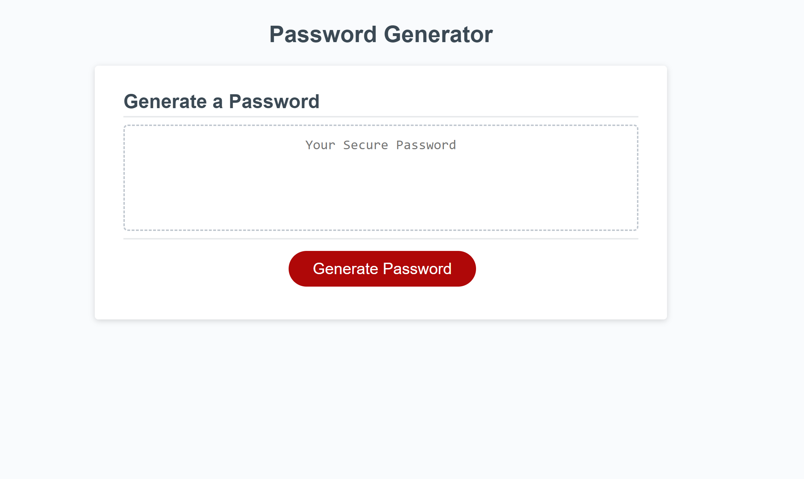

# Password Generator -OT

## Description 

### User Story

```
AS AN employee i often require passwords of different complexities 
I WANT a code that generates a random password based on my selected criterias (i.e. length and character type)
SO THAT i can easily create dynamic passwords
```

### Acceptance Criteria

```
* Password is generated when a button is clicked on the page.

* The JavaScript code prompts user for length of password.

* The JavaScript code prompts user for character types.

* The JavaScript code validates users option to add aracter types lowercase, uppercase, numeric and/or special characters.

* The code must ensure user selects atleast one of the character type options.

* Password is generated based on user selected preferences and displayed on the page.

```

## Table of Contents

* [Description](#description)
* [Usage](#usage)
* [Credits](#credits)
* [License](#license)

## Usage 

### Deployed Application

* The URL of the deployed application:
[https://thorbieey.github.io/Password-Generator/](https://thorbieey.github.io/Password-Generator/)

* The URL of the GitHub repository: 
[https://github.com/Thorbieey/Password-Generator.git](https://github.com/Thorbieey/Password-Generator.git)

#### Screenshot/Demo



## Credits

* [Learn about changing strings to lowercase](https://developer.mozilla.org/en-US/docs/Web/JavaScript/Reference/Global_Objects/String/toLowerCase)
* [Meet array prototype: **push()**](https://developer.mozilla.org/en-US/docs/Web/JavaScript/Reference/Global_Objects/Array/push#:~:text=The%20push()%20method%20adds,new%20length%20of%20the%20array.)
* [Meet document method: **querySelector**](https://developer.mozilla.org/en-US/docs/Web/API/Document/querySelector)
* [Learn about addEventListener method](https://developer.mozilla.org/en-US/docs/Web/API/EventTarget/addEventListener)

## License

Licensed under the [MIT](https://choosealicense.com/licenses/mit/) license